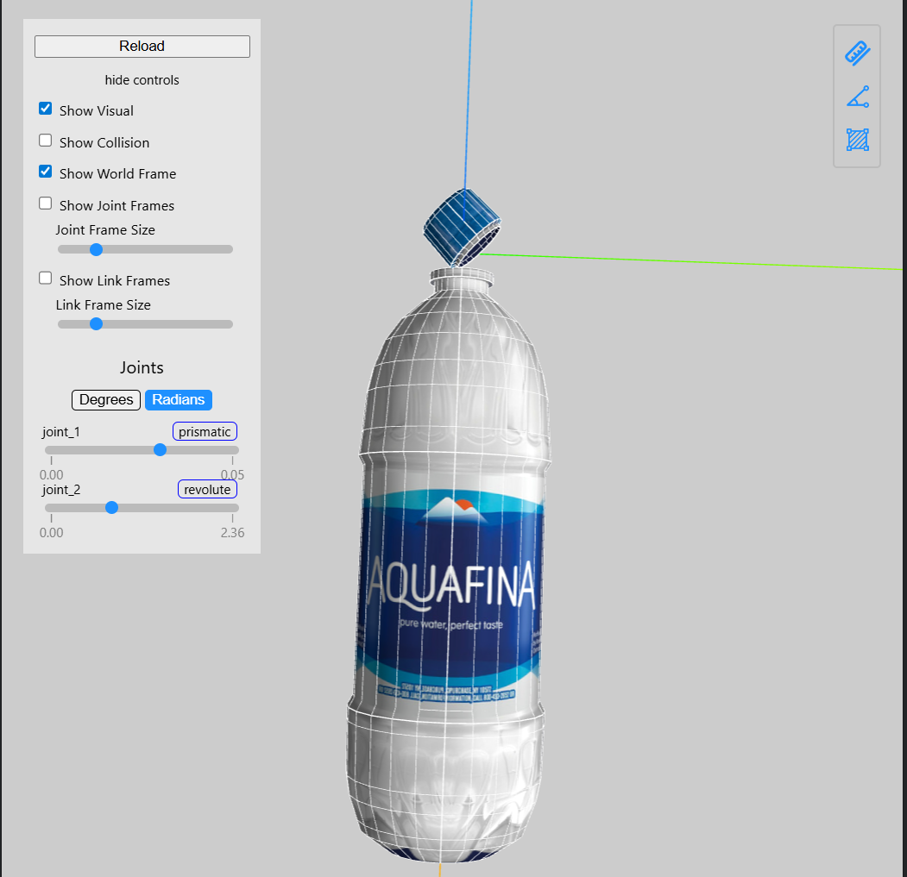
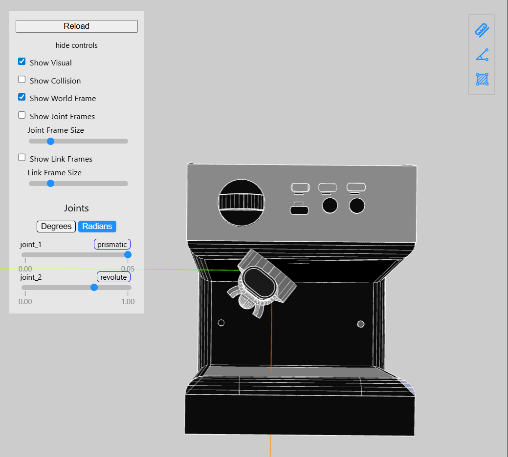
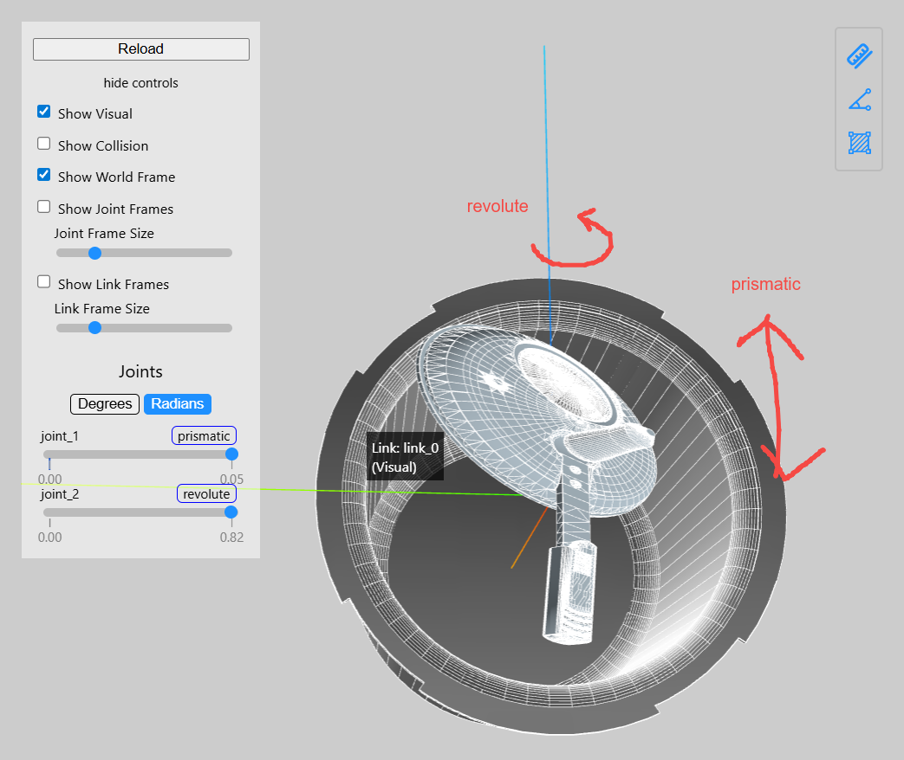
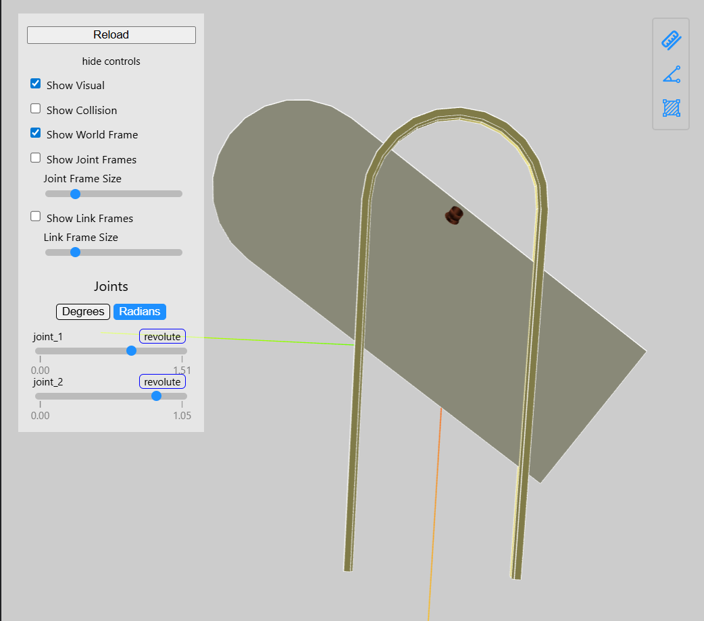
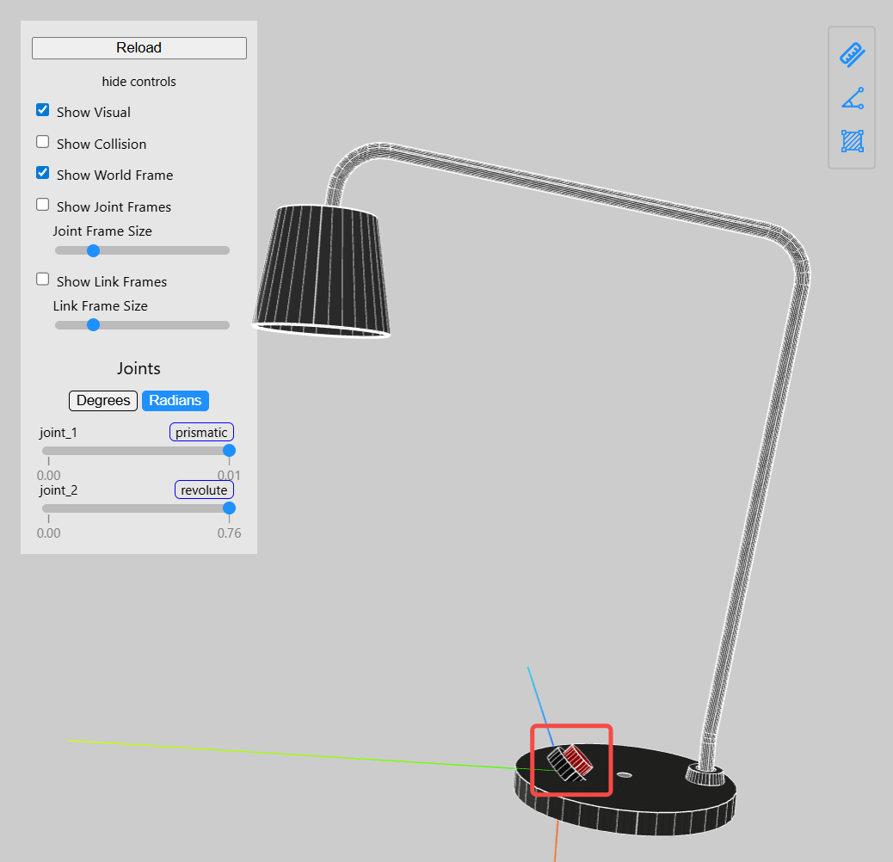
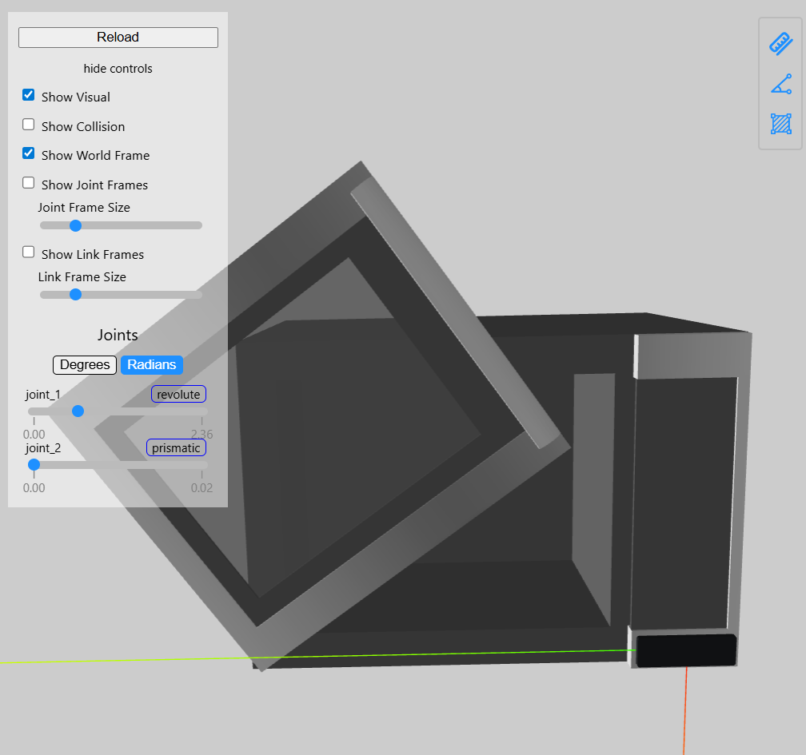
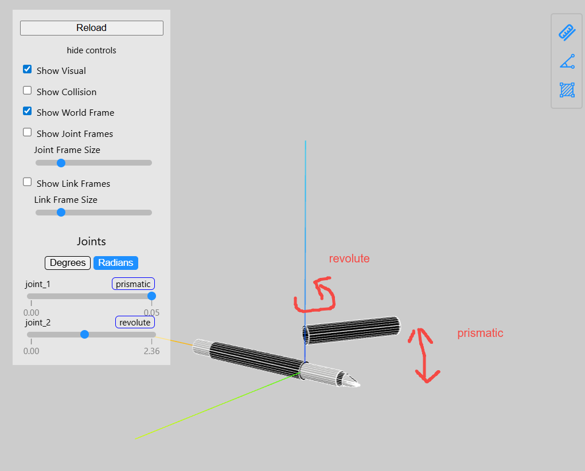
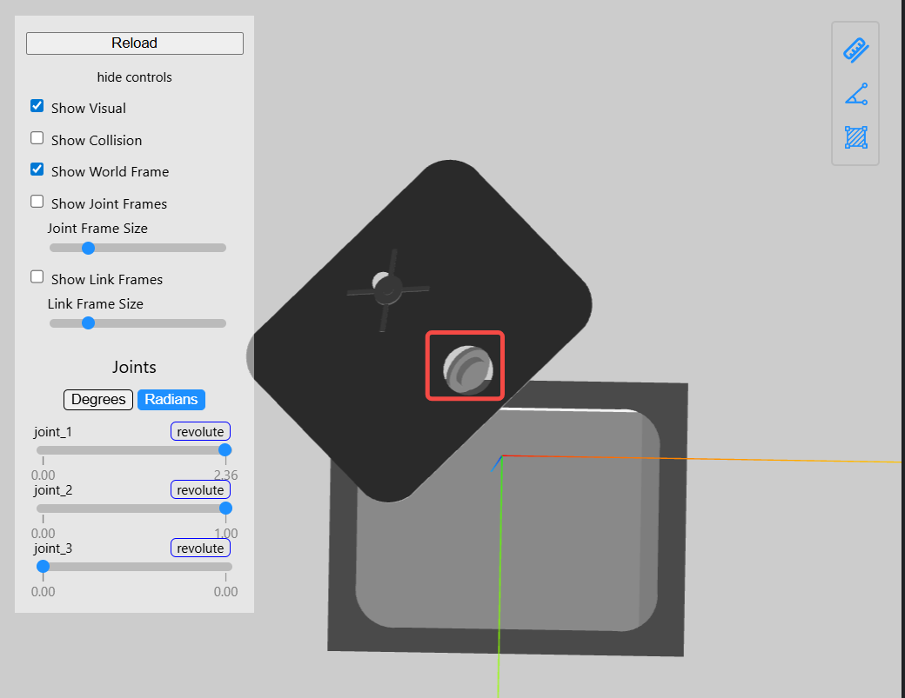
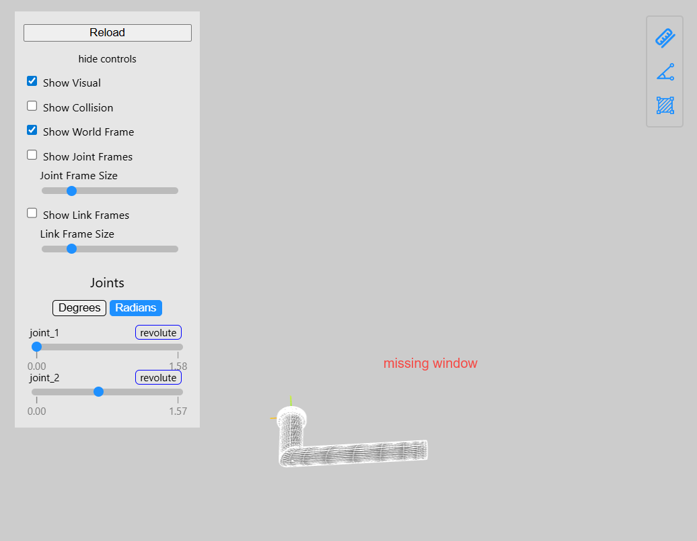

# All AdaManip assets are completely unusable
## Common issues:
1. incorrect joint coordinates leading to wrong joint movement direction(all assets)
2. inconsistent local coordinate systems across all assets
3. missing parts
4. low mesh quality
5. low texture quality

# Examples(category, id)
**For each category, randomly pick one URDF to visualize.**
## bottle, 9b
Bottle cap rotation direction is incorrect.

## coffee machine, cm9
Handle rotation direction is incorrect.

## presscooker, pc19
Lid rotation direction is incorrect; scaling issues present.

## door, 99660039962007
Door rotation direction is incorrect.

## lamp, 10
Switch rotation direction is incorrect.

## microwave, 9
Door rotation direction is incorrect.

## pen, 4
Pen cap rotation and removal directions are incorrect.

## safe, 5
Door and combination dial rotation directions are incorrect.

## window, 5
Window missing.

