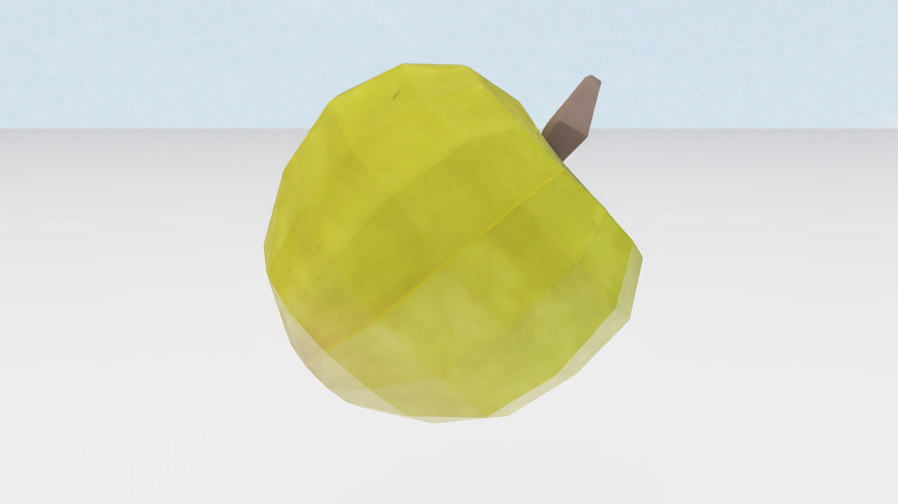
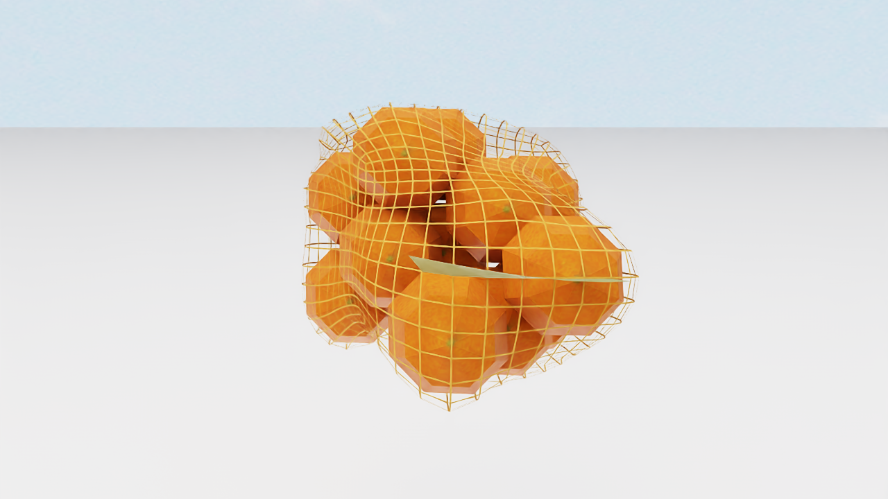
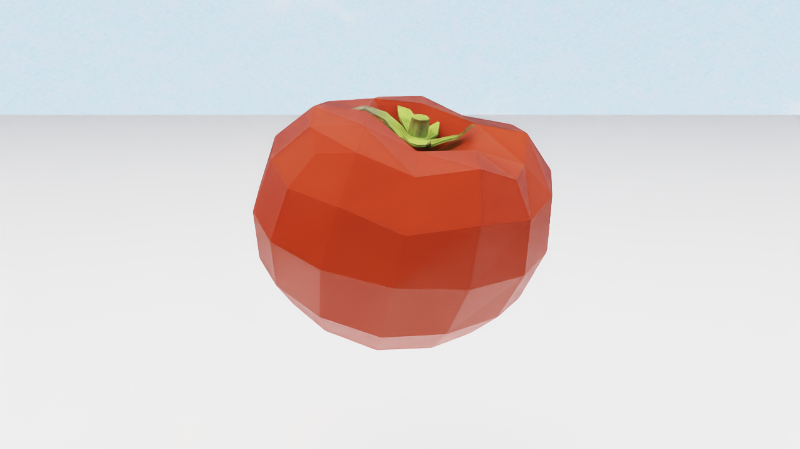
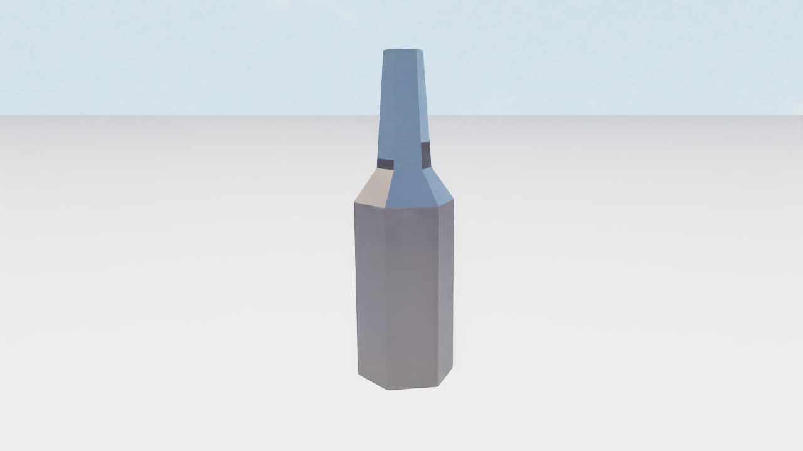
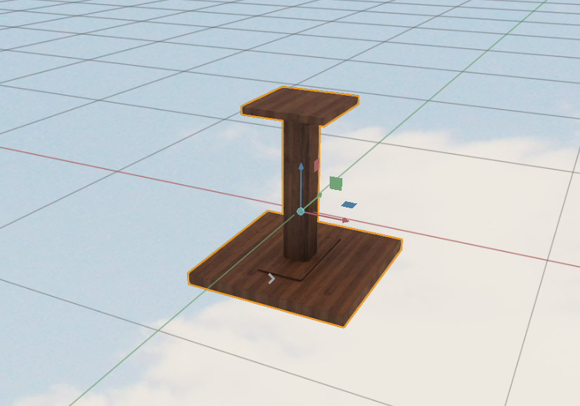
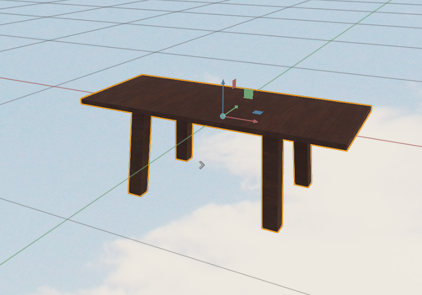
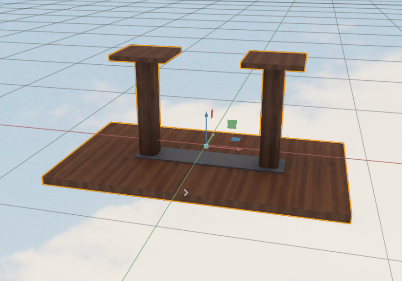
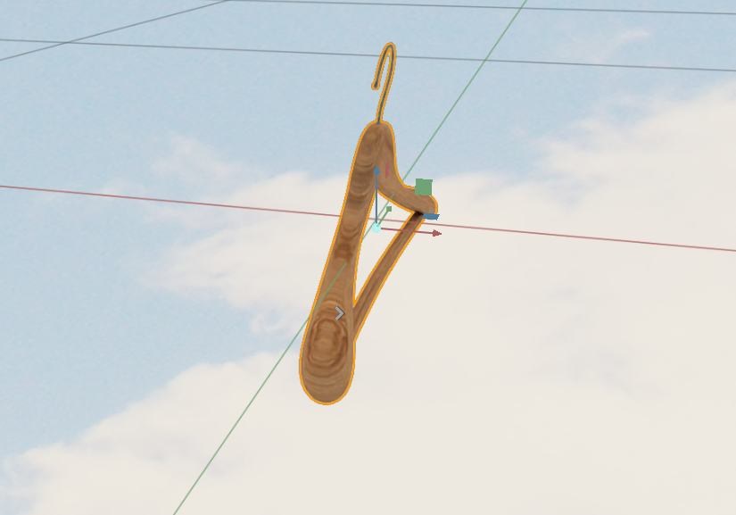
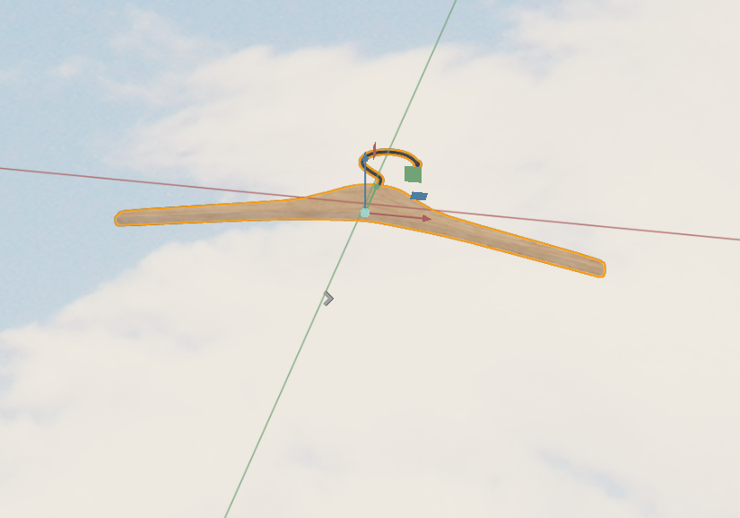
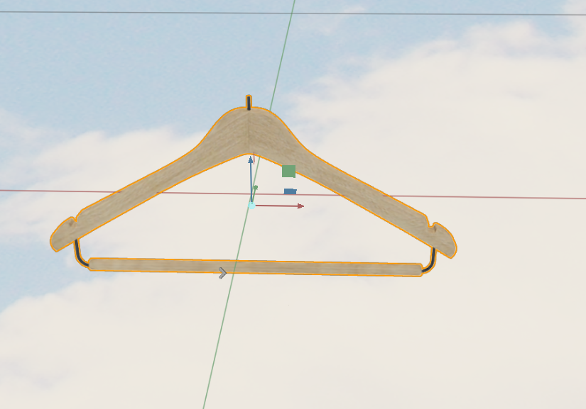

# 1. low mesh quality, examples(category, id)
## apple, dfgurb

## bag of oranges, vohgas

## beefsteak tomato, ogpans

# 2. low texture quality, examples(category, id)
## bottle of water, cyzaue

## bottle of wine, jivcff

# 3. inconsistent local coordinate systems across all assets, examples(category, id)
## breakfast_table, iaritq

## breakfast_table, idnnmz

## breakfast_table, jcqdlx

## hanger, lymqks

## hanger, nagryh

## hanger, sfdekb

